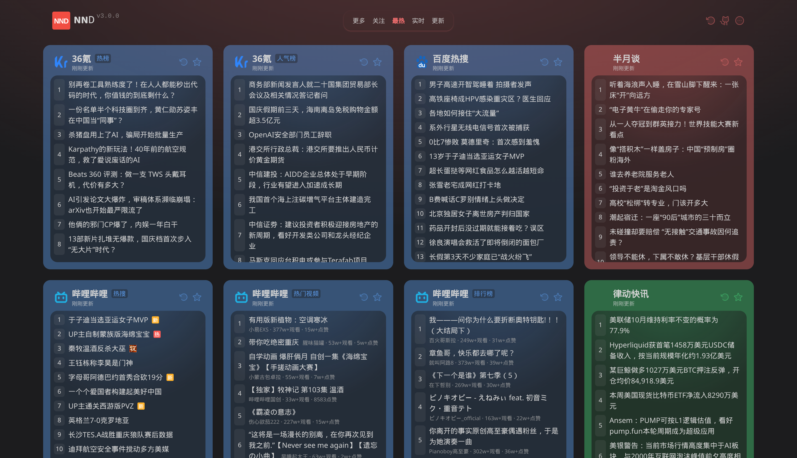
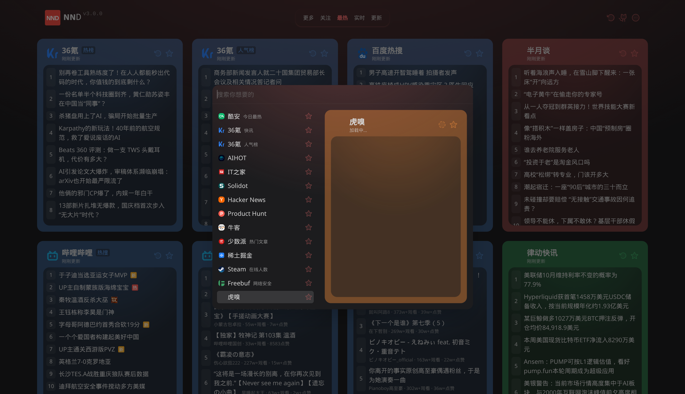
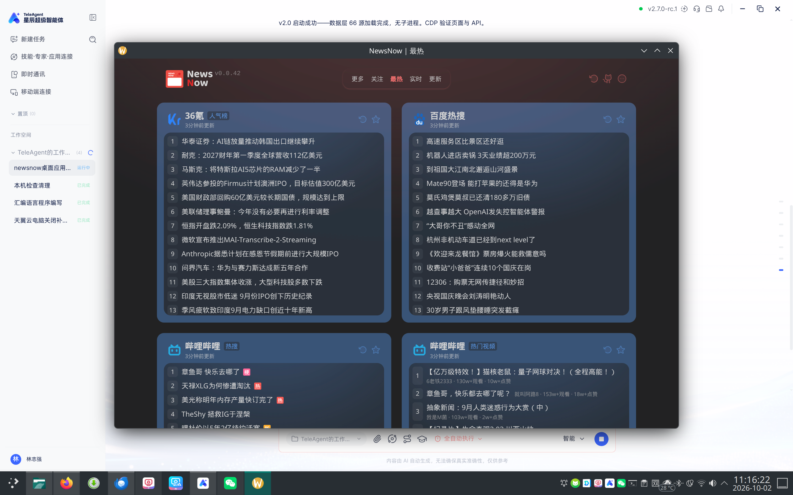

# NND — NewsNow Desktop

> **NND**（NewsNow Desktop）是基于 [newsnext/newsnow](https://github.com/newsnext/newsnow)（作者 ourongxing）改造的**跨平台新闻聚合阅读器**，支持 **Linux、Windows、Android、iOS** 四平台。

由 [TeleAgent](https://github.com/kane250) 打包发布，致敬原项目 [NewsNow](https://github.com/newsnext/newsnow)。

当前版本：**v2.6.3**

---

## 功能特性

### 新闻阅读

- **85 个新闻源**：知乎、微博、百度、36氪、B站、抖音、雪球、Hacker News、Product Hunt、财联社、华尔街见闻、IT之家、央视新闻、人民网、虎嗅、财新网、FT中文网、纽约时报中文、法广、爱范儿、钛媒体、极客公园、界面新闻、中新网、人民日报、国务院、豆瓣、微信读书等（v2.6.0 规整：去除 12 个冗余/重复源，分类与命名统一）
- **选择订阅**：星标订阅，分类管理（科技/国内/国际/财经/体育）
- **定期刷新**：自动刷新定时器（5/10/15/30/60 分钟可配），按各源自身间隔缓存
- **按需刷新**：单源刷新按钮 + 一键刷新全部（Ctrl+R）
- **内置阅读器**：点击新闻在程序内部查看，支持后退/前进，移除地址栏仅显示来源域名
- **广告拦截**：阅读器内置 EasyList 精简规则，自动隐藏广告、弹窗、推广、「下载 App」浮层等干扰元素
- **禁止自动播放**：三层防护阻止媒体自动播放，退出阅读器时同步关闭

### 内容智能

- **标题去重**：同一批次相似标题自动合并（2-gram Jaccard 相似度 > 0.8），减少重复信息
- **阅读时间估算**：每篇文章标注预计阅读时间，阅读器右下角浮标显示
- **关键词高亮**：搜索面板可高亮阅读器中的关键词

### 个性化

- **主题切换**：深色/浅色外观，设置中一键切换
- **阅读优化**：字体大小（12-22px）和行距（1.4-2.4）可调，文章正文最大宽度 780px 居中
- **自定义 RSS 源**：设置中添加任意 RSS/Atom Feed URL，不限于内置 85 个源
- **数据导入导出**：一键导出/导入书签、阅读历史、自定义 RSS 源与阅读设置（JSON 备份文件），方便备份与迁移
- **订阅列表导出（OPML）**：全部 85 个内置源（按分类分组）+ 自定义 RSS 源导出为标准 OPML 2.0 文件，可导入 Tiny Tiny RSS / Feedly / Inoreader 等阅读器；39 个 RSS/RSSHub 源携带可直接订阅的 xmlUrl，其余 API 热榜源保留名称/分类/站点链接
- **订阅列表导入（OPML）**：一键导入其他阅读器导出的 OPML 订阅列表，导入前逐源验证（真实抓取测试，能抓到内容才入库）并三层去重（与内置源重复、与已有自定义源重复、文件内重复），验证进度实时显示，失败的源逐个列出原因

### 书签 / 历史 / 搜索

- **书签**：收藏感兴趣的文章，随时查看和管理
- **阅读历史**：自动记录已读文章（保留最近 200 条），支持清除
- **跨源搜索**：搜索已加载的新闻标题，实时过滤匹配结果
- **备份迁移**：书签/历史/RSS 源/设置可导出为 JSON 文件，在新设备一键导入（按 URL 去重合并，现有数据优先）

### 系统集成

- **关闭按钮驻留托盘**：关闭窗口最小化到系统通知栏，右键菜单含显示/刷新/书签/设置/关于/退出
- **单实例锁**：只允许运行一个 NND 实例，第二个实例启动时聚焦已有窗口
- **自动更新**：启动后自动检查 GitHub Releases 新版本，后台下载，提示安装重启

## 下载安装

### Windows

从 [Releases](https://github.com/kane250/NND/releases/latest) 下载 `NND-x.x.x-win-x64-setup.exe`，双击安装即可。安装包会创建桌面快捷方式和开始菜单快捷方式（名称均为 NND）。

### Linux

| 格式 | 说明 |
| --- | --- |
| `NND-x.x.x-x86_64.AppImage` | 免安装运行，chmod +x 后直接执行 |
| `NND-x.x.x-amd64.deb` | Debian/Ubuntu 安装包 |
| `NND-x.x.x-x86_64.pkg.tar.zst` | Arch/Manjaro 安装包（`sudo pacman -U`） |

### Android

`NND-x.x.x-android.apk` — 直接安装（需开启「未知来源」；v2.6.3 起为 release 优化构建，非 debug 版）。

### 从源码运行

```bash
git clone https://github.com/kane250/NND.git
cd NND
npm install                # 安装 Electron
./start.sh                # Linux/macOS   |   start.bat   # Windows
```

无需 setup、无需 Node.js 运行时、无原生模块编译。

## 操作说明

| 操作 | 方式 |
| --- | --- |
| 刷新全部 | **Ctrl+R** 或菜单「视图 → 刷新全部」 |
| 打开设置 | **Ctrl+,** 或托盘右键「设置…」 |
| 书签/历史/搜索面板 | **Ctrl+B** 或菜单「视图 → 书签面板」 |
| 直接搜索 | **Ctrl+Shift+F** |
| 阅读新闻 | 点击标题 → 内置阅读器 |
| 阅读器后退/前进 | **Alt+← / Alt+→** |
| 返回新闻列表 | **Esc** |
| 检查更新 | 菜单「帮助 → 检查更新…」 |
| 退出程序 | 托盘右键「退出」或菜单「NND → 退出」 |

## v2.0 架构（桌面端）

```
┌──────────────────────────────────────────────┐
│            Electron 进程（唯一进程）            │
│                                              │
│  ┌────────────── 主进程 ──────────────┐      │
│  │ data-layer.mjs（85源抓取+缓存）      │      │
│  │ · myFetch: Node fetch（无CORS）     │      │
│  │ · 缓存: userData/data-cache.json    │      │
│  │ · 内容智能: 去重+阅读时间+高亮       │      │
│  └───────────────┬───────────────────┘      │
│                  │ import                    │
│  ┌───────────────┴───────────────────┐      │
│  │ protocol.handle("app")           │      │
│  │ · app://local/api/s?id=x → 数据层  │      │
│  │ · app://local/api/bookmarks → 书签 │      │
│  │ · app://local/api/history → 历史    │      │
│  │ · app://local/api/rss → 自定义源    │      │
│  │ · app://local/assets/... → web/   │      │
│  └───────────────┬───────────────────┘      │
│                  │ app:// 协议               │
│  ┌───────────────┴───────────────────┐      │
│  │ BrowserWindow（React 前端）        │      │
│  │ + 内置阅读器（WebContentsView）     │      │
│  │ + 广告拦截 + 禁止自动播放 + 阅读优化 │      │
│  │ + 书签/历史/搜索面板注入            │      │
│  └───────────────────────────────────┘      │
└──────────────────────────────────────────────┘
```

**v1 → v2 对比**：

| | v1.0 | v2.0+ |
| --- | --- | --- |
| 服务端 | nitro(h3) 子进程（随机端口） | 主进程内数据层（app:// 协议） |
| 原生模块 | better-sqlite3（需编译/安装） | **无** |
| 安装步骤 | clone → setup → start | **clone → start** |
| Node.js 依赖 | 需要（运行子进程） | **不需要**（仅构建时用） |
| 启动 | 1~3 秒（服务就绪轮询） | 即时 |
| 内存 | +1 个 Node 子进程 | 单进程 |
| 新闻源 | 59/66 | **84/85**（新增 27 源 + 规整去重 12 源） |

## 项目结构

```
NND/
├── main.cjs                # Electron 主进程：app:// 协议 + 数据层 + 阅读器 + 托盘 + 菜单
├── merge-data.cjs         # 导入合并逻辑（书签/历史/RSS 去重合并，与测试共用）
├── opml.cjs               # OPML 2.0 订阅列表生成/解析（与测试共用）
├── rss-feed.cjs           # 自定义 RSS 源抓取（主进程与 OPML 导入验证共用）
├── data-layer.mjs          # 数据层 bundle（85 源抓取+缓存，构建产物）
├── viewer.html             # 内置阅读器工具栏 UI
├── viewer-preload.cjs      # 阅读器 IPC 桥
├── settings.html           # 设置窗口 UI（卡片式布局，含 RSS 管理）
├── settings-preload.cjs    # 设置 IPC 桥
├── package.json            # electron-builder 构建配置（NND/nsis/AppImage/deb）
├── build-icon.png/.ico     # NND 统一图标（各平台）
├── build.sh                # 从源码构建前端 + 数据层 + 品牌补丁
├── start.sh / start.bat    # 启动脚本
├── tests/
│   └── run-tests.mjs       # 自动化测试（22 项）
├── scripts/
│   ├── build-data.mjs      #   数据层构建（mobile/src → data-layer.mjs）
│   ├── patch-web-sources.mjs #  前端源配置补丁（新源注入/废弃源清理/缓存修复）
│   └── patch-branding.mjs  #   品牌定制补丁（NND logo/版本号/GitHub链接/版权）
├── web/                    # React 前端静态资源（构建产物）
│   ├── assets/index-*.js   #   前端 bundle（含内联源配置，patch 后同步）
│   ├── index-v2.html       #   入口文件（规避 Chromium 缓存）
│   ├── icon.svg / pwa-*.png#   NND 图标
│   └── manifest.webmanifest
├── mobile/                 # 移动端（Capacitor）
│   ├── src/
│   │   ├── fetch.ts        #     跨平台 HTTP（Electron/Capacitor/浏览器 三分支）
│   │   ├── cache.ts        #     缓存（桌面JSON/Capacitor Preferences/localStorage）
│   │   ├── getters.ts      #     85 源注册表
│   │   ├── sources/        #     79 个新闻源抓取逻辑
│   │   └── sources-data.json #   源元数据
│   ├── android/            #   Android 原生项目
│   └── ios/                #   iOS 原生项目
├── .github/workflows/
│   └── build-release.yml   #   GitHub Actions 四平台并行构建 + Release 自动发布
└── NewsNow-Desktop.desktop #   Linux 桌面菜单集成
```

## 数据源

**85 个新闻源**（v2.6.0 规整：去除 11 个纯 redirect 重复源与 1 个内容重复源；Freebuf/牛客/Steam 归位科技分类；同名源站统一命名、子栏目 title 齐全）。

| 分类 | 数量 | 代表源 |
| --- | --- | --- |
| 科技 | 26 | 36氵、IT之家、Hacker News、Product Hunt、虎嗅、cnBeta、少数派、爱范儿、钛媒体、极客公园、Steam、Freebuf、牛客、V2EX、Solidot、异次元软件 |
| 国内 | 33 | 知乎、微博、百度、抖音、澎湃新闻、央视新闻、人民网、百度贴吧、半月谈、界面新闻、中新网、人民日报时政/社会/军事、国务院政策/新闻、豆瓣、B站、微信读书 |
| 财经 | 17 | 华尔街见闻、财联社、雪球、财新网、FT中文网、金十数据、第一财经、格隆汇、律动快讯 |
| 国际 | 7 | 联合早报、参考消息、法广、纽约时报中文、卫星通讯社、人民日报国际 |
| 体育 | 2 | 虎扑、懂球帝 |

## 从源码构建

### 构建前端 + 数据层

```bash
./build.sh        # 需要 pnpm + Node.js（克隆原项目 → pnpm build → 补丁 → 数据层）
```

`build.sh` 会自动执行：
1. 克隆原项目并 `pnpm build` 生成前端资源
2. `patch-web-sources.mjs` — 注入新源/清理废弃源/同步「更多」列表/修复 Chromium 缓存
3. `patch-branding.mjs` — NND logo/版本号/GitHub 链接/版权信息/页面标题

### 单独重建数据层

```bash
node scripts/build-data.mjs    # 需 mobile 端 npm install
```

### 构建 Release 产物

```bash
# Linux
npx electron-builder --linux AppImage deb pacman --publish never

# Windows
npx electron-builder --win nsis --publish never

# 全平台
npx electron-builder -mlw --publish never
```

或推送 git tag `v*` 触发 GitHub Actions 自动构建四平台并发布 Release。

### 运行测试

```bash
node tests/run-tests.mjs       # 22 项自动化测试
```

## GitHub Actions CI

推送 `v*` tag 自动触发四平台并行构建：

| 平台 | 产物 | 运行环境 |
| --- | --- | --- |
| Linux | AppImage + deb + pacman | ubuntu-22.04 |
| Windows | nsis 安装包 (setup.exe) | windows-latest |
| Android | release APK | ubuntu-22.04 |
| iOS | 未签名 ipa | macos-14 |

构建完成后自动创建 GitHub Release 并上传所有产物。

## 移动端构建

```bash
cd mobile
npm install
node build-web.mjs          # 构建 Web 资源
npx cap sync android        # 同步 Android

# Android APK（release 构建，debug 密钥签名）
cd android && ./gradlew assembleRelease
# 产物: android/app/build/outputs/apk/release/app-release.apk

# iOS（需 Mac + Xcode）
npx cap sync ios && npx cap open ios
```

## 截图

| 新闻列表 | 内置阅读器 | 选择订阅 | 主界面 |
|:---:|:---:|:---:|:---:|
|  |  |  |  |

## 版本历史

| 版本 | 主要变更 |
| --- | --- |
| v2.6.3 | 发布产物调整：Linux 去除 tar.gz 改发 pacman 包（pkg.tar.zst，Arch/Manjaro 可直接安装）；Android 改 release 优化构建（去 debug 命名，体积 4.4→3.4MB） |
| v2.6.2 | 订阅列表导入（OPML）：导入前逐源真实抓取验证 + 三层去重（内置/已有/文件内）+ 进度推送；测试扩至 45 项 |
| v2.6.1 | 订阅列表导出（OPML 2.0）：全部内置源分类分组导出 + 自定义 RSS 源，39 个 RSS 源携带可直接订阅的 xmlUrl；测试扩至 38 项 |
| v2.6.0 | 内容源规整（97→85：去除重复源、分类修正、命名统一）+ 数据导入导出（书签/历史/RSS/设置）+ 测试扩至 33 项 |
| v2.5.0 | 减小产物体积：仅保留 zh-CN/en-US 语言包 + maximum 压缩 + 排除冗余资源（Windows exe 首次 <100MB） |
| v2.4.0 | 新增 27 个内容源（虫部落 RSS 清单），源总数 70→97 |
| v2.3.0 | 内容智能（标题去重/阅读时间/关键词高亮）+ 自动化测试（22 项） |
| v2.2.0 | 自定义 RSS 源 + 书签/历史 + 跨源搜索 |
| v2.1.0 | 主题切换 + 阅读优化 + 自动更新 + 移动端品牌同步 |
| v2.0.3 | 单实例锁 |
| v2.0.2 | 修复 Windows 启动失败（ESM import file:// URL） |
| v2.0.1 | 统一 NND 图标 + Windows nsis 安装包 |
| v2.0.0 | 主进程直抓架构（无子进程、无原生模块） |

## 致敬

本项目基于 [newsnext/newsnow](https://github.com/newsnext/newsnow)（作者 [ourongxing](https://github.com/ourongxing)）改造，原项目遵循 MIT 协议，本项目同样基于 MIT。

## 许可

MIT License — Copyright © 2026 TeleAgent
